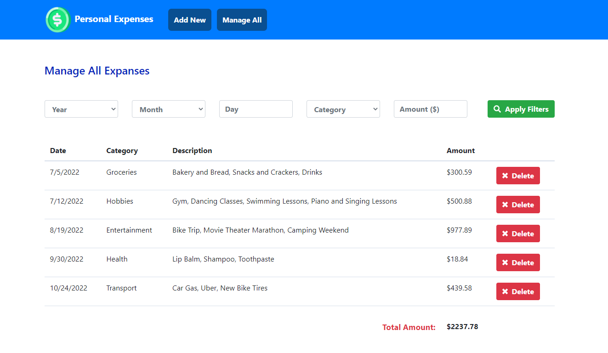

# Personal Expenses Management System

This project is a personal expenses management system coded JavaScript, HTML, CSS and Bootstrap. Chrome localStorage was used as the database.

## Screenshot 

## Database Information

The database was created with Chrome localStorage. The project must be opened on Chrome browser to work properly. The data is stored on the Chrome profile (if there's more than one on the machine). However, when the history is cleared, the data will also be cleared from localStorage and any record previously added will also be cleared.

## Technology Stack

+ JavaScript
+ Chrome localStorage
+ HTML
+ CSS
+ Bootstrap
